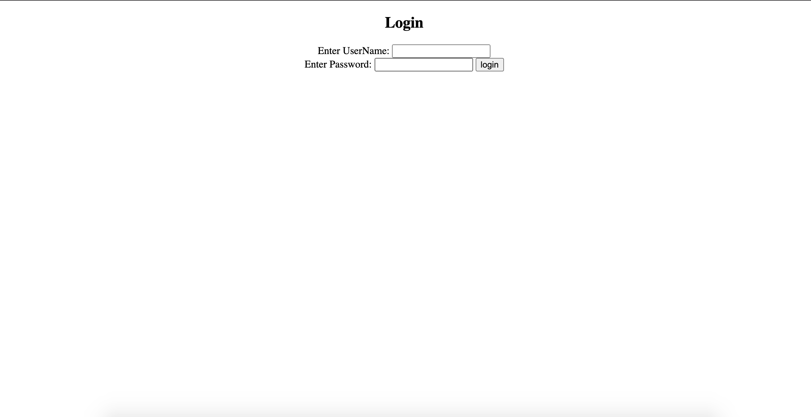
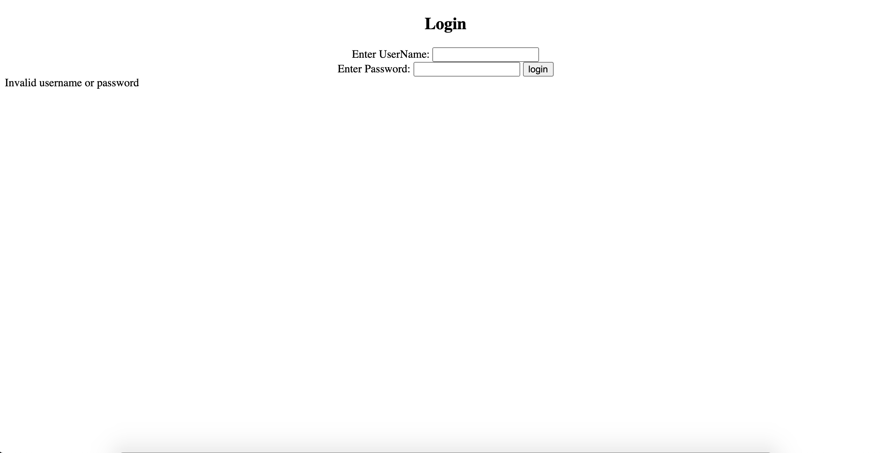

# Validation of the User Login

This program displays a basic login form on a html page and verifys the proper hard coded values...

## Features

	- Basic login form
	- Verifies hard coded credentials
	- On success brings user to success dashboard
	- Logout button on dashboard, bringing user back to login page

## Installation

	- Clone and pull source code from provided github repository
	- Compile source code with Java Compiler
	- Run with Java Runtime Environment

## Code

	https://github.com/nicholas-auyeung/Validation-of-the-User-Login

## Flow

1. Start by creating a 'Dynamic Web Project' in Eclipse

2. Create a login html page

3. Set html form with action 'LoginController'

4. Create 'LoginController' servlet

5. Select 'service' method upon creation

6. Inside 'service' method request username and password parameters

7. Instantiate RequestDispatcher

8. Compare requested username and password parameters with hard coded values

9. If success request and foward to 'DashboardController' servlet 

10. If fail request and include to 'login.html'

11. Create 'DashboardController' servlet

12. Select 'service' method upon creation

13. Inside 'service' setContentType to "text/html" in order to read HTML strings

14. Instantiate PrintWriter

15. Write print statements to dynamic page, header, welcome user, and date logged in

16. Hyperlink logout button to return to login

## Usage

	*Default hard coded username:TestUser1 password:passwordfortestuser1

	Once run, the webpage will ask for user credentials

User inputs incorrect credentials
	
	User will be prompt with 'invalid username or password' message and login form will be reset

User inputs correct credentials
	
	User will be prompt with the dynamic 'Dashboard' page as indicated on the header, a welcome message, and the date that user has successfully logged in.
	

	User then can click 'logout' to logout and return to login page

